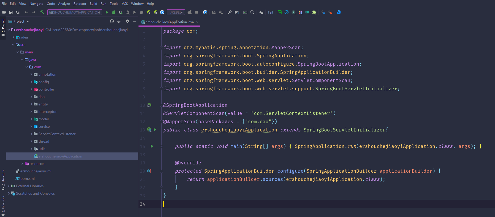
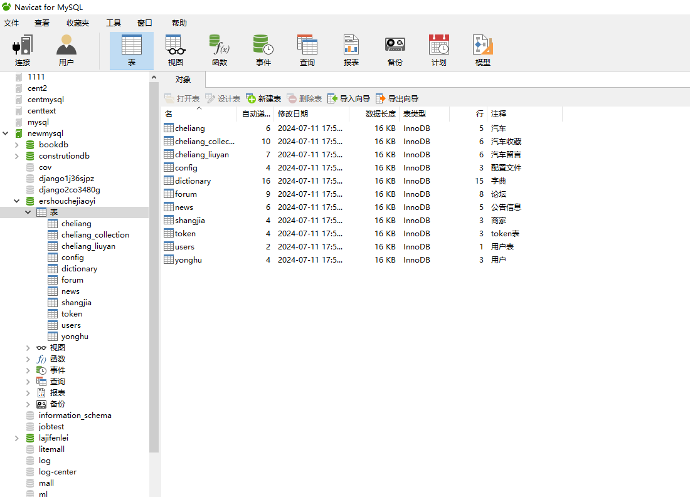
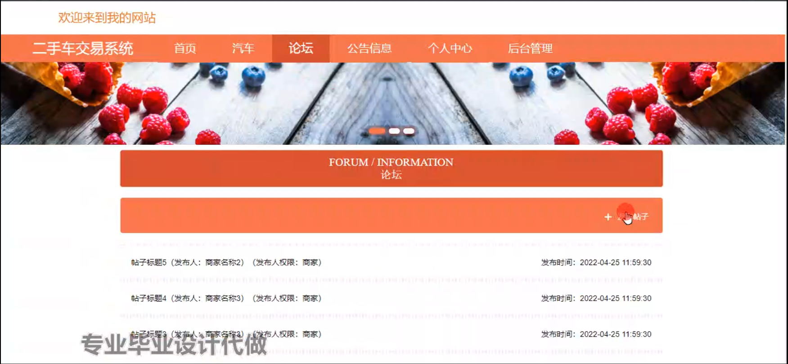
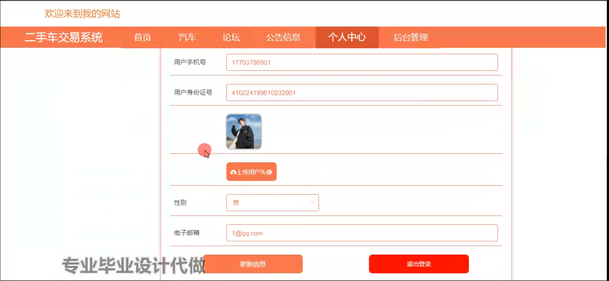
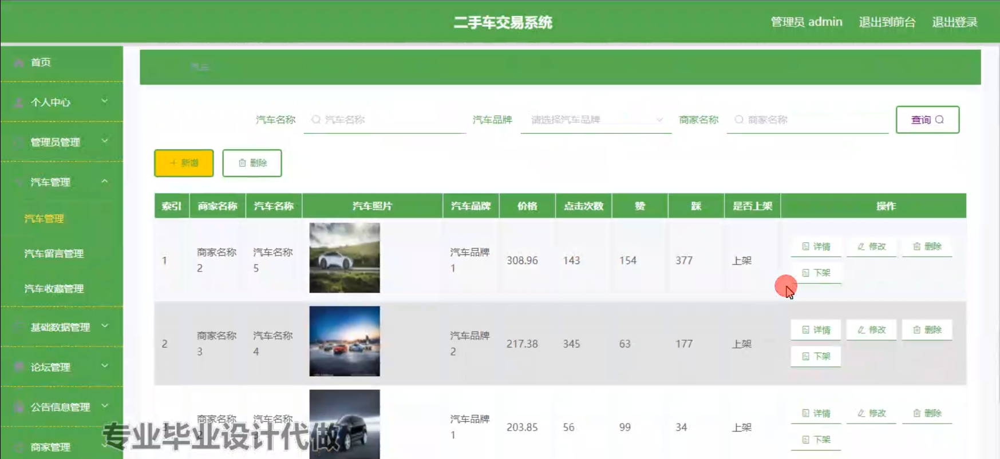
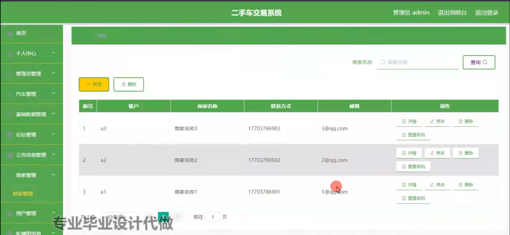
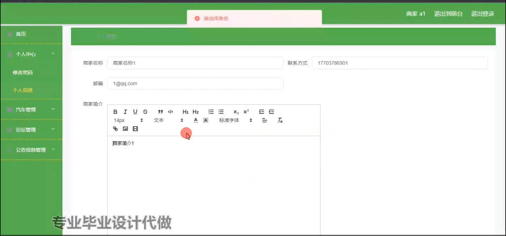
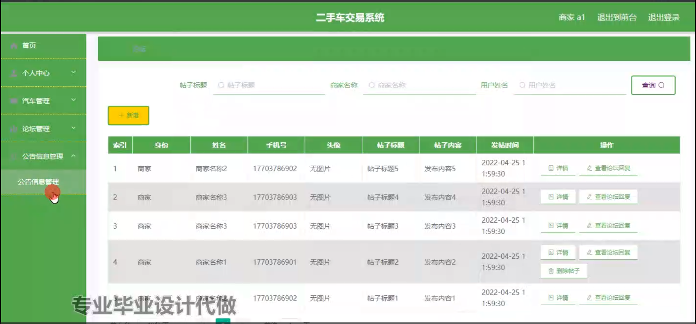
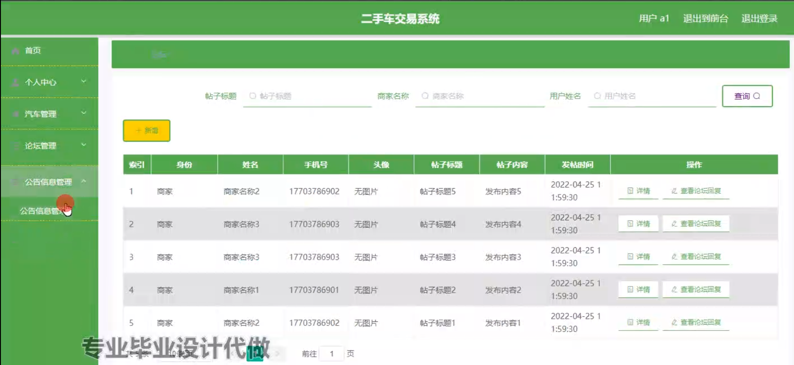

# 基于springboot的二手车交易系统

#### 介绍

随着汽车消费市场的不断发展，二手车交易日益活跃。为了满足二手车交易的需求，提高交易效率和透明度，我们开发了这套基于 Spring Boot 的二手车交易系统。该系统旨在为管理端、商家端和用户端提供便捷、高效、安全的服务，促进二手车交易的规范化和信息化。

#### 技术栈

后端技术栈：Springboot+Mysql+Maven

前端技术栈：Vue+Html+Css+Javascript+ElementUI

开发工具：Idea+Vscode+Navicate

#### 系统功能介绍

（一）管理端  
个人中心：管理端人员可以在个人中心查看和修改自己的个人信息，查看系统操作记录和通知。  
管理员管理：对系统中的其他管理员进行添加、删除、修改以及权限分配，确保管理团队的合理配置和职责明确。  
汽车管理：全面管理二手车的信息，包括车辆的基本信息（品牌、型号、年份、里程等）、车况描述、图片、价格等，对车辆信息进行审核和监管，保证信息的真实性和准确性。  
基础数据管理：维护系统运行所需的基础数据，如车型分类、车辆配置选项、地区信息等。  
论坛管理：监督论坛的交流内容，处理违规言论，确保论坛的交流环境健康、有序。  
公告信息管理：发布和管理系统的公告信息，如促销活动、政策变动、重要通知等，确保用户及时获取关键信息。  
商家管理：对入驻平台的商家进行资质审核、信息管理和行为监督，保障商家的合法合规经营。  
用户管理：管理系统用户的注册信息、交易记录、信用评级等，维护用户数据的安全和完整性。  
轮播图信息管理：负责轮播图的内容更新和展示顺序调整，以突出重点推荐的车辆或活动。  

（二）商家端  
汽车：展示和管理自己所售的二手车信息，包括车辆上架、修改车辆详情、设置价格和促销策略等。  
论坛：参与论坛交流，发布车辆相关的技术分享、行业动态等内容，与用户和其他商家互动。  
公告信息：及时获取系统发布的公告信息，了解平台的最新政策和活动。  
个人中心：查看和修改自己的商家信息，管理交易记录和财务报表。  
后台管理  
汽车管理：对所售汽车进行更细致的管理，如库存管理、销售数据分析等。  
论坛管理：可以对自己在论坛发布的内容进行编辑和删除，回复用户的咨询和评论。  
公告信息管理：查看与自身业务相关的公告信息，确保业务合规和及时响应平台要求。  

（三）用户端  
汽车：浏览平台上的二手车信息，通过筛选条件快速找到符合需求的车辆，查看车辆详情和图片。  
论坛：在论坛中与其他用户和商家交流购车经验、咨询车辆问题、分享使用心得等。  
公告信息：获取平台的最新通知和重要信息，了解市场动态和平台优惠活动。  
个人中心：管理个人资料、查看购车订单、收藏的车辆、咨询记录等。  
后台管理  
汽车管理：收藏感兴趣的车辆，对关注车辆进行对比和分析。  
论坛管理：发布自己的问题和见解，管理自己在论坛的发言。  
公告信息管理：标记已读和重要的公告信息，方便后续查阅。  

#### 系统作用

规范交易流程  
为二手车交易提供标准化的流程和规范，减少交易纠纷，保障买卖双方的权益。  
提高交易效率  
便捷的信息检索和沟通渠道，使买家能够快速找到心仪的车辆，卖家能够高效地推广车辆，缩短交易周期。  
增强信息透明度  
详细的车辆信息和真实的用户评价，让交易过程更加公开、公正，增加用户信任度。  
促进市场发展  
为商家提供更广阔的销售渠道，为用户提供更多的选择，推动二手车市场的繁荣。  
提升用户体验  
友好的界面设计和个性化的服务，满足不同用户的需求，提高用户满意度和忠诚度。  

#### 系统功能截图

代码结构

数据库表

登录

前台页面首页

汽车

论坛

公告信息

个人中心

管理员端汽车管理

商家管理

商家端后台管理

公告信息管理

用户端后台管理

#### 总结

基于 Spring Boot 的二手车交易系统，通过区分管理端、商家端和用户端的功能模块，实现了二手车交易的全流程管理和服务。该系统不仅为二手车交易提供了一个高效、便捷、安全的平台，也为二手车市场的健康发展注入了新的活力。

#### 使用说明

创建数据库，执行数据库脚本 修改jdbc数据库连接参数 下载安装maven依赖jar 启动idea中的springboot项目

前台登录页面
http://localhost:8080/ershouchejiaoyi/front/index.html

后台登录页面
http://localhost:8080/ershouchejiaoyi/admin/dist/index.html

管理员				账户:admin 		密码：admin

商家				账户:a1 		密码：123456

用户				账户:a1 		密码：123456